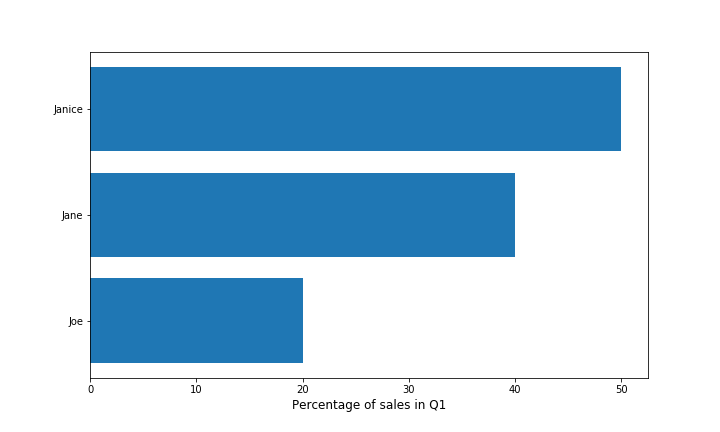

# Data Visualization - Quiz

We recommend you **do not** use Python to answer these questions. Instead, based on what you have learned in this section, _reason_ the code to choose an expected answer. 


???

# Matplotlib and Seaborn


?: Is anything wrong with the plot below? 

<p align="center">

</p>

( ) Nope, everything looks fine! 
(X) Yes, the data seems to be messy/wrong 
( ) Yes, this data is better represented as a pie chart 
( ) Yes, this data is better represented as a vertical bar chart 


?: What kind of plot(s) would you use to examine the distribution of a numeric variable? 

[ ] Scatter plot 
[X] Boxplot 
[ ] Bar plot 
[X] Histogram   


?: In what order should you run the following commands in order to generate and display a plot?   

1. `plt.legend()`  
2. `x = np.linspace(1, 10, 20)`   
3. `plt.show()`   
4. `plt.xlabel('X-Label')`  
5. `plt.plot(x, label='Example Plot')`  

 
( ) 4-2-1-3-5  
(X) 2-5-4-1-3  
( ) 5-4-1-3-2  
( ) 1-2-4-3-5 


?: Fill in the blanks such that the code block generates the following figure: 

```python
import matplotlib.pyplot as plt
sample_figure = plt.figure()
# 1
ax1 = ___
# 2
ax2 = ___

# Draw plots
ax1.hist(data)
ax2.boxplot(data)
plt.show()
```

<p align="center">

</p>


( ) 1: `ax.add_subplot(122)` | 2: `ax.add_subplot(121)`  
(X) 1: `sample_figure.add_subplot(121)` | 2: `sample_figure.add_subplot(122)`    
( ) 1: `add_subplot(121)` | 2: `add_subplot(122)`  
( ) 1: `sample_figure.add(1, 2, 2)` | 2: `sample_figure.add(1, 2, 1)`  


?: Fill in the blanks such that the code block generates the following figure: 


```python
import seaborn as sns
sns.set_style('darkgrid')
# 1
ax = ___(x='cyl', y='mpg', data=df)
# 2
___(xlabel = "Cylinders", ylabel='Miles per gallon')
```

<p align="center">

</p>


( ) 1: `sns.boxplot` | 2: `sns.set`    
( ) 1: `boxplot` | 2: `ax.set`    
( ) 1: `boxplot` | 2: `ax.set_labels`    
(X) 1: `sns.boxplot` | 2: `ax.set`


???